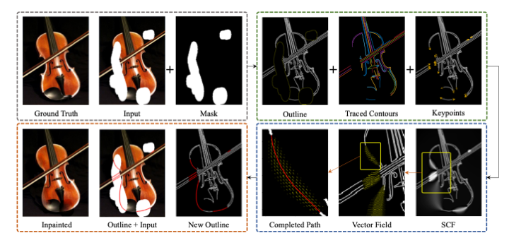

<h1 align="center"> Contour-guided Image Completion with Perceptual Grouping </h1>

<h1 align="center">
  
</h1>

<h2 align="center"> Authors </h2>

Morteza Rezanejad*, Sidharth Gupta*, Chandra Gummaluru, Ryan Marten, John Wilder, Michael Gruninger, Dirk Walther
 
 
 

# Citation 

If you use this code for your research, please cite our BMVC 2021 paper: Contour-guided Image Completion with Perceptual Grouping (citation coming soon).
 
 
 

# Set-up 

1. Install Python 3.8 on your computer
2. Install pip on your computer for managing python packages
3. Create and activate a virtual environment.
4. Install all package dependencies with `pip install -r requirements.txt`.
 
 
 

# Project Structure

## Running a simple example

To generate a Stochastic Completion Field (SCF) for two points as discussed in our BMVC 2021 paper, run the code in `Stochastic_Completion_Fields_Pipeline.ipynb`. In our paper, we integrate this SCF generating framework with image inpainting and denoising.
 
 

## Random_Walks_Implementation

In this folder you will find a simple Monte-Carlo algorithm that generates approximate Stochastic Completion Fields using random walks. For details, see the included `Random_Walks.pdf` file inside this folder. 
 
 

## fokker_planck_experiment_runner

Our pipeline to generate Stochastic Completion Fields (SCFs) using the command line. This pipeline generates `.npz` files, which we integrated with EdgeConnect and Image Denoising algorithms to achieve the results in our paper.

### Execution of pipeline

Inside the `config` folder, we provide a sample source and sink configuration for our SCF. Run the following command.

`python3 experiment_runner.py --config_file configs/two_points.yml --experiment_dir experiments/two_points/`

The results will be saved in the `experiments` directory that we specify. In this case, `experiments/two_points/`. In here, the completion field will be saved as a `.npz` file. You may use this `.npz` file in any application you wish.
 
 
