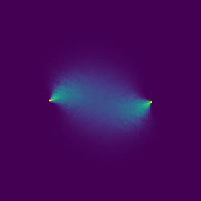

<h1 align="center"> Stochastic Completion Fields </h1>

  

<h2 align="center"> Abstract </h2>

We revisit Stochastic Completion Fields: A Neural Model for Illusory Contour Shape and Salience, published by Lance R. Williams and David W. Jacobs in 1997. First, we formally present the mathematical theory as described by Williams and Jacobs, which is centered around the assumption that the prior probability distribution of completion curves can be modelled by random walks of a particle. Then, we explain our Python implementation of the Stochastic Completion Fields theory, filling in missing details about the algorithm that were left out of the original paper. We justify our implementation decisions with the ultimate goal of computational efficiency. We reproduce Williams and Jacobs’ experimental results and demonstrate the ability of our implementation to find contour completions in illusions that are consistent with human perception. We then further analyze the behaviour of the algorithm by experimenting with hyperparameters: the count, length, and variance of the random walks. 

### Running the Code

The Stochastic Completion Field algorithm is impemented in  [`src/SCF_Generation.ipynb`](https://github.com/gupta-sid/Stochastic_Completion_Fields/blob/master/src/SCF_Generation.ipynb). You can view the notebook with the GitHub viewer, or run it yourself on [Colab](https://colab.research.google.com/github/gupta-sid/Stochastic_Completion_Fields/blob/master/src/SCF_Generation.ipynb) or in Jupyter on your local machine.

### More Details 
View our [`report.pdf`](https://github.com/gupta-sid/Stochastic_Completion_Fields/blob/master/report.pdf) or watch our [presentation](https://drive.google.com/file/d/1kwKo6OVQ3h0UTKbVrdQpWKn7HIXH9NES/view?usp=sharing) for more information. 

